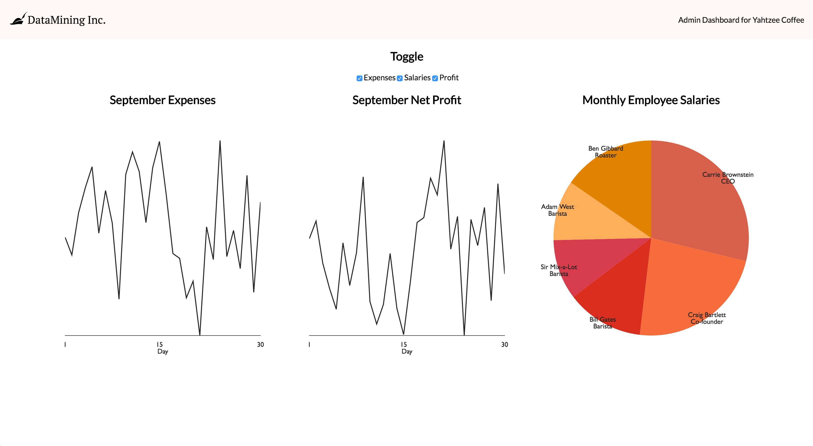

# React Business Dashboard

## Introduction

> ***Note:*** _This can be a pair programming activity or done independently. Your instructor(s) will give you instructions._

You have just joined DataMining Inc. (DMI), a company that creates data dashboards for businesses and organizations. DMI needs your help to finish an MVP for one of their clients: a coffee shop called Yahtzee Coffee. This coffee shop has a few datasets that need to be visualized for the owner.

Some consultants started creating a React application, and they completed one of the graph visualizations. It's your job to add two more.

## Exercise

#### Requirements

- Add the appropriate graphs for displaying the following datasets
  - Employee salaries over a month (recommended: pie chart)
  - Daily net profit over a month (recommended: line graph)
- Each graph should be rendered using [Victory](https://github.com/FormidableLabs/victory), the data visualization library that the consultants started using.
- Each graph should be its own component
- Each graph component should have the ability to be toggled on/off using the provided toggle component
- Each graph component should have at least one test, using the built-in Enzyme/Jest testing platform
- Each graph component should be visually appealing, and styled using CSS

#### Bonuses

- Save the state of the checkboxes using `localStorage`, so the state will persist after refreshing the page.
- Add additional styling to the page and your graph components

#### Starter code

The provided starter code uses the `create-react-app` template, so setup can be done by running `npm install` in the folder. Check the `package.json` file for the other scripts you can use for development and testing. Also, become familiar with the directory structure and the functionality of any existing components.

#### Deliverable

Here's an example screenshot of the finished deliverable. The finished deliverable should have two additional graphs, and all graphs should be toggled on/off by the provided checkboxes.

## Additional Resources

- You'll be using [Victory](https://github.com/FormidableLabs/victory), an open source library we haven't covered before. Become familiar with the documentation and try creating throwaway examples in a separate repo.
